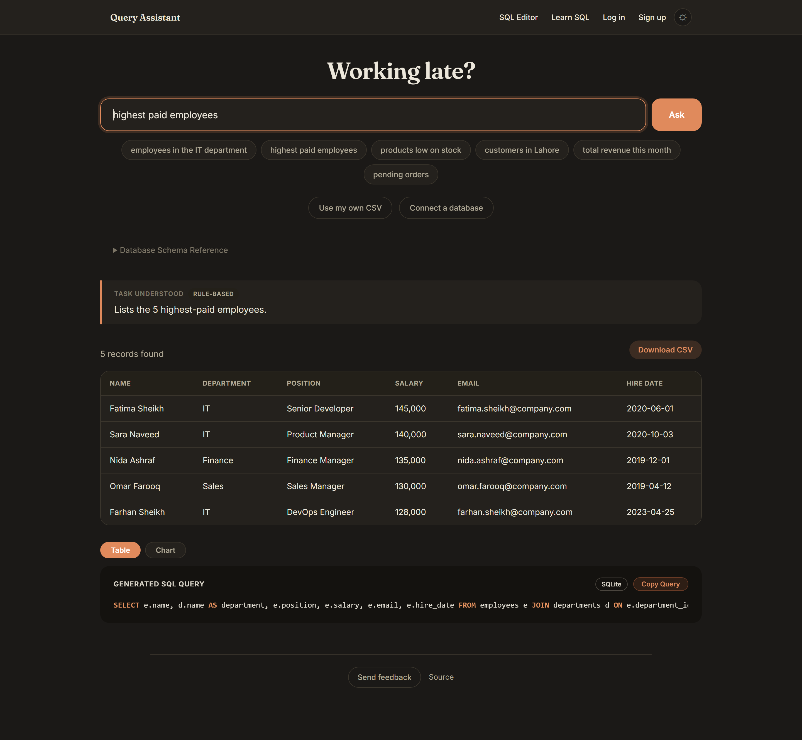
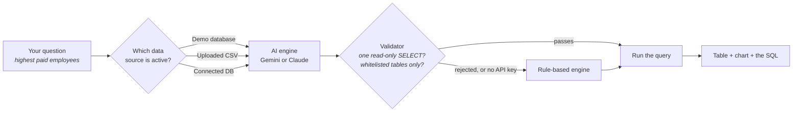
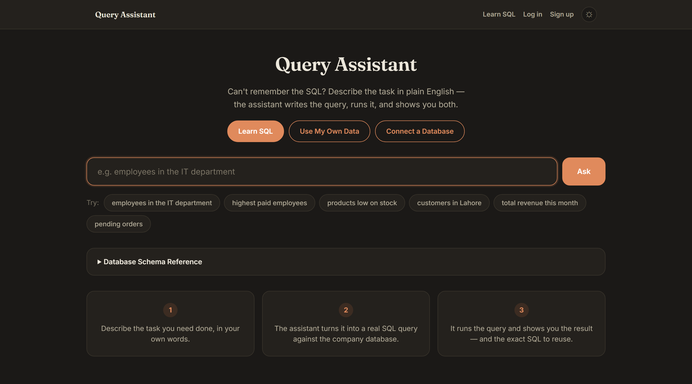
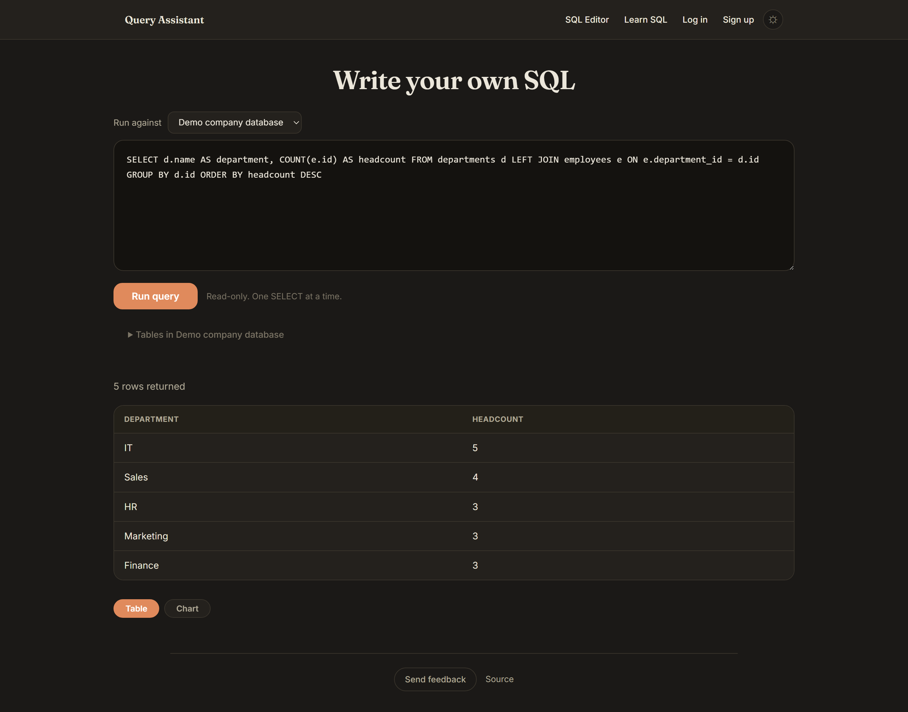
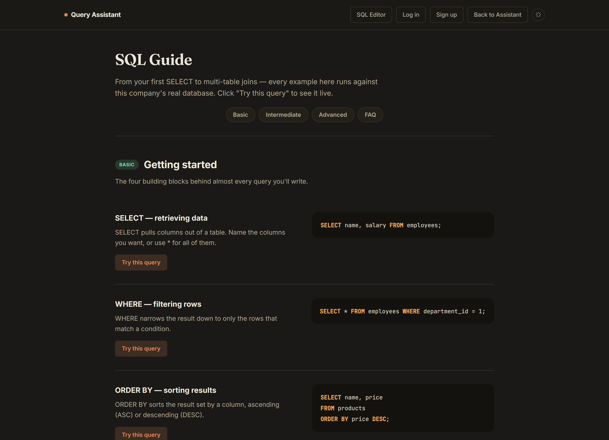
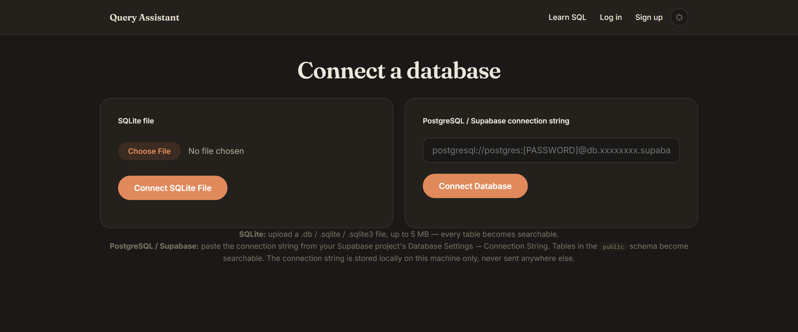
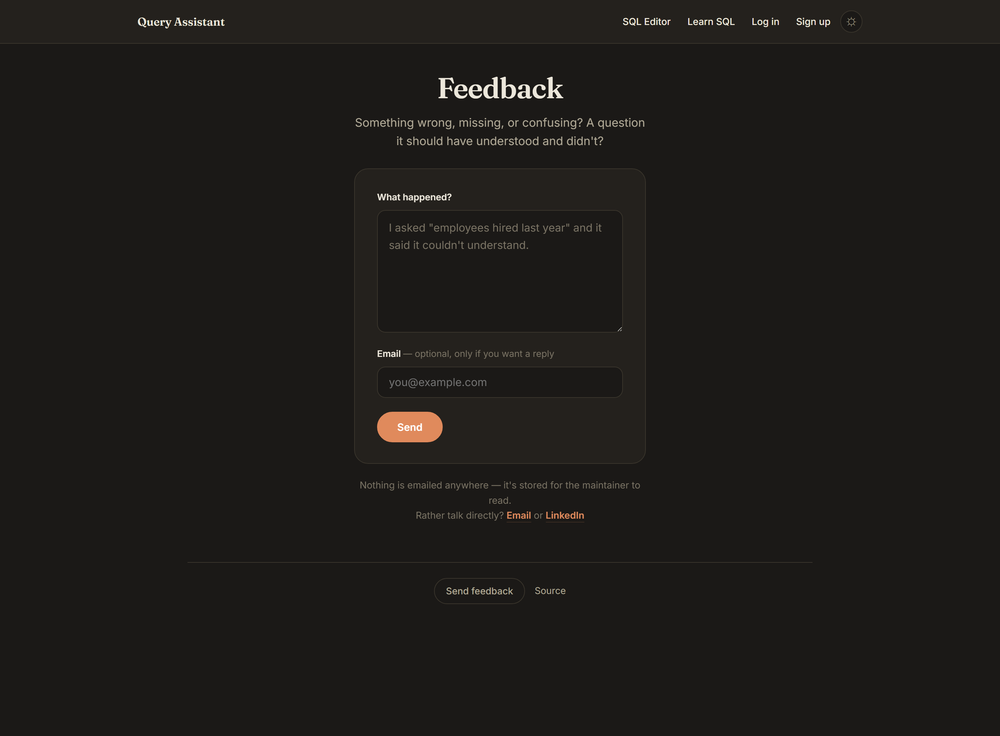
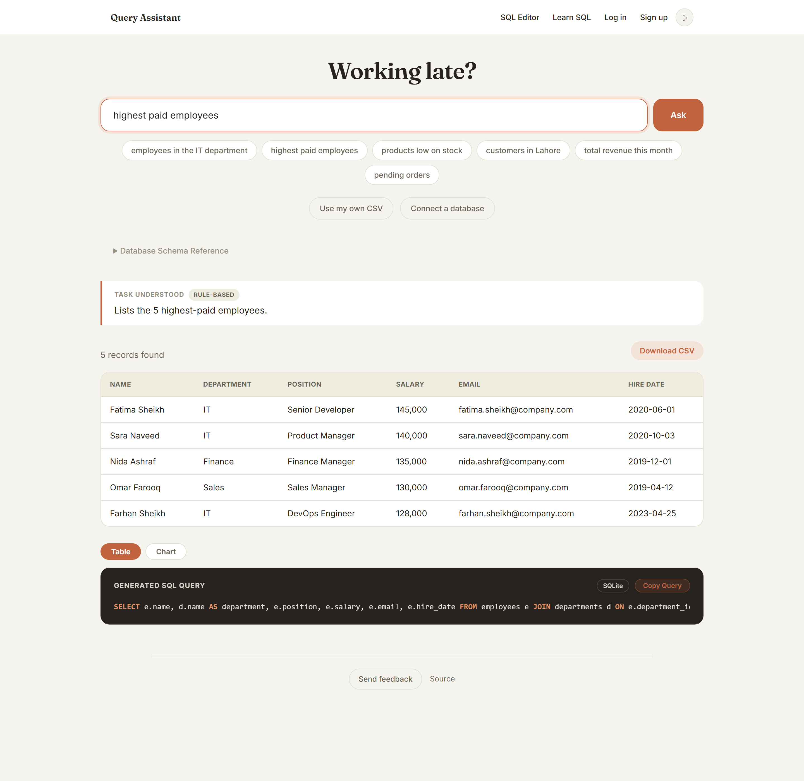

<div align="center">

# Query Assistant

**Ask a question in plain English. Get back real SQL, the answer, and a chart.**

Type *"highest paid employees"* and the app writes the `SELECT`, runs it, shows you the rows,
and hands you the query so you can learn from it or reuse it. Works against a built-in demo
database, a CSV you upload, or your own SQLite / PostgreSQL database.

[](https://github.com/abdulhaseebofficial/query-assistant/actions/workflows/ci.yml)
[](https://www.python.org/)
[](https://flask.palletsprojects.com/)
[](tests/)
[](https://docs.astral.sh/ruff/)
[](LICENSE)



</div>

---

## The idea

Most people know what they want out of a database. Far fewer remember the exact `JOIN`
syntax to get it.

Query Assistant sits in that gap. You describe the task the way you'd describe it to a
colleague — in English or Roman Urdu — and it shows you the SQL it wrote alongside the
answer. Over time the SQL stops being a black box, which is the actual point: it's a tool
for getting answers *and* a way to pick up SQL by reading queries that solve problems you
actually had.

## What it does

| | |
|---|---|
| **Plain-English questions** | *"employees in the IT department"*, *"products low on stock"*, *"total revenue this month"* |
| **Roman Urdu too** | Not just the odd word — *"IT walay employees"* filters by department, *"aaj ke orders"* by date, *"total kitni sales hui"* totals rather than counts, *"sirf aik"* returns one row |
| **Shows its work** | Every answer comes with the generated SQL, syntax-highlighted and copyable |
| **Or write the SQL yourself** | A `/sql` editor for when you already have a query. Runs against any attached source, through the same read-only validator that guards model-written SQL, and tells you which rule you hit rather than only refusing |
| **Bring your own model** | Google Gemini or Anthropic Claude writes the SQL — set whichever key you have, or neither, and a rule-based engine takes over so the app never hard-fails |
| **Says when it doesn't know** | The rule-based engine answers only the phrasings it genuinely encodes. Ask it something it can't express and it says so, and says why, instead of returning a table that looks like an answer |
| **Your own data** | Upload a CSV, connect a SQLite file, or paste a PostgreSQL / Supabase connection string |
| **Uploaded data answers back** | A spreadsheet gets the same treatment: *"total revenue"*, *"highest revenue"*, *"sab dikhao"* — column names are understood as columns rather than searched for as text |
| **Tables and charts** | Results render as a table, and as a bar / line / pie chart when the shape of the data suits one |
| **CSV export** | Download any result set |
| **Accounts and history** | Optional sign-up; every question you ask is saved so you can find that query again |
| **Learn SQL page** | A built-in guide from `SELECT` to multi-table joins, where every example runs live against the demo database |
| **Light and dark** | Follows your preference, remembered across visits |
| **Feedback** | A box on every page for what's wrong, missing, or should have been understood. Stored, not emailed — nothing to configure and nothing to fail silently. `ADMIN_USERNAME` names the account that can read it |
| **A page that gets out of the way** | The heading is a greeting that follows the reader's clock; everything else on screen is something to use, not something explaining what to use |

## Quick start

```bash
git clone https://github.com/abdulhaseebofficial/query-assistant.git
cd query-assistant

python -m venv .venv
source .venv/bin/activate          # Windows: .venv\Scripts\activate

pip install -r requirements.txt
cp .env.example .env               # Windows: copy .env.example .env

python run.py
```

Open <http://127.0.0.1:5000>. The demo database seeds itself on first run — there is no
migration step and no external service to install.

**No API key needed.** With no key at all the app runs on its rule-based engine and every
feature still works. Add a `GEMINI_API_KEY` or an `ANTHROPIC_API_KEY` to `.env` when you
want a model handling the questions the rules don't cover — the app picks up whichever one
it finds.

## How a question becomes an answer



The validator is the part worth knowing about. The AI engine executes SQL that a language
model wrote, so before anything runs it has to be a single read-only `SELECT` against an
explicitly whitelisted set of tables. That whitelist matters because the demo data and the
app's own `users` table live in the same SQLite file — without it, a cleverly worded
question could talk the model into `SELECT * FROM users`. See
[`tests/security/test_sql_guardrails.py`](tests/security/test_sql_guardrails.py) for the specific attacks
that are covered.

If the AI engine is unavailable, returns something invalid, or produces SQL that fails to
run, the rule-based engine picks it up. There is no state in which a missing API key
breaks the app.

The rule-based engine is deliberately narrow, and it knows it. It recognises a fixed set
of phrasings; anything asking for a threshold, a ranking, a negation, a date range, or a
grouping is something its templates cannot express. Rather than fall through to "list
everything" — which is what it used to do, returning all 18 employees for *"employees
earning more than 100000"* under the explanation "Lists all employees, sorted by name" —
it declines and the page explains which part it couldn't handle and that an API key
would answer it. A confidently wrong answer is worse than no answer.

The same rule applies to the parts of a question it *does* understand: a filter is
either applied or the question is refused, never silently dropped. That distinction
is what most of `tests/unit/domain/test_roman_urdu.py` exists to hold in place — "IT walay
employees" once returned all eighteen employees, explained as "Lists all employees",
because the department filter fell through without a word.

## Screenshots

<table>
<tr>
<td width="50%"><br><b>Ask anything</b><br>The heading follows the reader's clock — this one was taken at 2am.</td>
<td width="50%"><br><b>Or write the SQL yourself</b><br>Read-only, one SELECT, against whichever source you pick.</td>
</tr>
<tr>
<td><br><b>Learn SQL</b><br>Every example is a real query you can run against the demo data.</td>
<td><br><b>Connect a database</b><br>A SQLite file, or a PostgreSQL / Supabase connection string.</td>
</tr>
<tr>
<td><br><b>Say what's wrong</b><br>Stored rather than emailed, so it can't fail quietly.</td>
<td><br><b>Light theme</b><br>Follows your preference, remembered across visits.</td>
</tr>
</table>

## Data sources

The app queries one source at a time, and you switch between them from the nav.

| Source | How you connect it | What becomes searchable |
|---|---|---|
| **Demo database** | Nothing to do — it seeds on first run | 5 tables: departments, employees, products, customers, orders |
| **CSV upload** | `/upload` — any `.csv` up to 5 MB / 5,000 rows | Column headers are sanitised into SQL-safe names; numeric types are detected |
| **SQLite file** | `/connect-db` — upload a `.db` / `.sqlite` / `.sqlite3` | Every table in the file |
| **PostgreSQL / Supabase** | `/connect-db` — paste a connection string | Every table in the `public` schema |

Connection strings are stored on your own machine, in `instance/uploads/`, and are never sent
anywhere else. That folder is git-ignored — but see [SECURITY.md](SECURITY.md) for why you
should still point it at a read-only database user.

## Project structure

The application is an installable `src/query_assistant` package with a Flask application
factory, feature Blueprints, services, framework-independent query rules, repositories,
and infrastructure adapters. Templates and static assets are packaged with the web layer;
local runtime state lives under `instance/`.

See [the authoritative architecture guide](docs/architecture/PROJECT_STRUCTURE.md) for
the complete tree, responsibility map, startup flow, dependency rules, and extension
guidance.

## Deployment

The app stores its data — accounts, saved query history, the demo tables, uploaded CSVs —
wherever `DATABASE_URL` points. Leave it unset and that's a SQLite file, which is right
for local use and wrong for anything serverless, because a serverless host has no disk
that survives a restart.

### Vercel

`vercel.json` and `api/index.py` are in the repo, so importing it into Vercel deploys
without further setup. Set three environment variables under
**Project Settings → Environment Variables**, then redeploy:

| Variable | Value | Why |
|---|---|---|
| `DATABASE_URL` | a PostgreSQL connection string | **Required.** Without it the app falls back to a SQLite file in `/tmp`, which Vercel wipes — accounts and history would vanish between requests |
| `SECRET_KEY` | any long random string | Without it each instance generates its own, so logins break immediately |
| `GEMINI_API_KEY` | a key from [AI Studio](https://aistudio.google.com/apikey) | Optional, and what makes the deployment able to answer questions the rule engine can't |

A free PostgreSQL database takes about two minutes:

1. Sign up at [neon.tech](https://neon.tech) (or [supabase.com](https://supabase.com))
2. Create a project — any region near your users
3. Copy the connection string. **Use the pooled one** if you're offered a choice:
   serverless opens a new connection per request and a direct connection will run out
4. Paste it into Vercel as `DATABASE_URL`

The schema is created on first boot, so there's no migration step. A custom domain works
normally once this is set — **Project Settings → Domains**.

One thing stays temporary on Vercel regardless: an external database attached through
**Connect a Database** is written to `/tmp`, so that connection is lost on a restart.
Everything else persists.

### A host with a real disk

Render, Railway, Fly.io, or any VPS. Nothing special is required — no `DATABASE_URL`, no
`DATA_DIR` — as long as the disk persists:

```bash
pip install gunicorn
gunicorn 'query_assistant.app:app' --bind 0.0.0.0:$PORT
```

Set `SECRET_KEY`, and `SESSION_COOKIE_SECURE=true` once you're serving over HTTPS. Point
`DATABASE_URL` at PostgreSQL here too if you'd rather not depend on a disk.

Rate limiting uses in-memory counters, so on any multi-instance host the limits are
per-instance. Point `Limiter(storage_uri=...)` at Redis if that matters to you.

## Configuration

Everything is optional except `SECRET_KEY` in production. Copy `.env.example` to `.env`
and fill in what you need.

| Variable | Default | What it does |
|---|---|---|
| `SECRET_KEY` | random per process | Signs session cookies. Leave it unset locally and logins simply won't survive a restart; **set it in production**. |
| `GEMINI_API_KEY` | unset | Enables Gemini-powered SQL generation. `GOOGLE_API_KEY` works as an alias. |
| `ANTHROPIC_API_KEY` | unset | Enables Claude-powered SQL generation. With no AI key at all, the rule-based engine handles everything. |
| `AI_PROVIDER` | auto | `gemini` or `anthropic`. Leave blank to pick automatically (Gemini first); set it to pin one provider while both keys stay in `.env`. |
| `GEMINI_MODEL` / `ANTHROPIC_MODEL` | `gemini-2.5-flash` / `claude-opus-5` | Move to a newer model without touching the code. |
| `FLASK_DEBUG` | `false` | Auto-reload and interactive tracebacks. **Never `true` in production** — Flask's debugger allows arbitrary code execution if it is reachable. |
| `DATABASE_URL` | unset | PostgreSQL connection string for the app's own data. Unset means a SQLite file under `DATA_DIR`. Required on any host without a persistent disk — see [Deployment](#deployment). |
| `DATA_DIR` | `./data` | Where the SQLite file and uploaded files are written. Only needed where the deployment directory is read-only. |
| `ADMIN_USERNAME` | unset | The account allowed to read submitted feedback at `/feedback/all`. Unset means nobody. |
| `SESSION_COOKIE_SECURE` | `false` | Set to `true` once you are serving over HTTPS, so cookies are marked `Secure` and HSTS is sent. Defaults off so local `http://` development works. |
| `ALLOW_PRIVATE_DB_HOSTS` | `false` | Allows PostgreSQL connections to localhost / private networks. Needed to connect a database on your own machine; leave off for anything internet-facing (see [SECURITY.md](SECURITY.md)). |

## Tests

```bash
pip install -r requirements.txt -r requirements-dev.txt

pytest              # the whole suite, about eighteen seconds
ruff check .        # lint
```

No network access and no API key required — the suite runs against a throwaway SQLite file
in a temp directory, so it never touches your real `data/company.db`. CI runs the same two
commands on Python 3.10 through 3.13, plus a third job that boots the app and makes an
actual HTTP request to it.

What's covered: the rule engine's question-to-SQL mapping and its use of bound parameters,
the SQL validator against a battery of injection and privilege-escalation attempts, CSV
header sanitisation and type inference, chart-worthiness decisions, and every route
including the security headers and the auth boundary on `/history`.
[`tests/README.md`](tests/README.md) walks through each file.

## Security

Full detail — including known limitations worth reading before deploying this anywhere
public — is in [SECURITY.md](SECURITY.md). The short version:

- User input is **never** concatenated into SQL. Engines return `(sql, params)` and values
  are bound. Identifiers that can't be bound are quote-escaped. There are tests asserting both.
- Model-generated SQL is validated before execution: one read-only `SELECT`, no stacked
  statements, whitelisted tables only.
- CSRF protection on every state-changing request; rate limits on `/login` and `/register`;
  password hashing via `werkzeug.security`; login verification that runs against a dummy
  hash for unknown users, so response timing doesn't leak which usernames exist.
- `X-Frame-Options`, `X-Content-Type-Options`, `Referrer-Policy`, and a CSP on every response.
- CSV exports neutralise spreadsheet formula injection; `Content-Disposition` filenames
  are sanitised; PostgreSQL DSNs pointing at private or loopback addresses are refused
  by default.
- The Flask debugger is off unless you explicitly opt in.

Found something? Please report it privately — see [SECURITY.md](SECURITY.md).

## Roadmap

Ideas worth building, roughly in order of usefulness. PRs welcome on any of them.

- [ ] Tighten the CSP to nonces instead of `'unsafe-inline'`
- [ ] Redis-backed rate limiting so limits hold across multiple workers
- [ ] Per-user datasets instead of one shared active source
- [ ] MySQL connector alongside SQLite and PostgreSQL
- [ ] Save a query from your history as a named, re-runnable report
- [ ] Multi-turn follow-ups — *"now just the ones in Karachi"*

## Contributing

Contributions are welcome. [CONTRIBUTING.md](CONTRIBUTING.md) covers setup, the two
commands to run before opening a PR, and the couple of conventions worth knowing (mainly:
never f-string user input into SQL).

## License

[MIT](LICENSE) — do what you like with it.

---

<div align="center">
<sub>Built by <a href="https://github.com/abdulhaseebofficial">Abdul Haseeb</a></sub>
</div>
